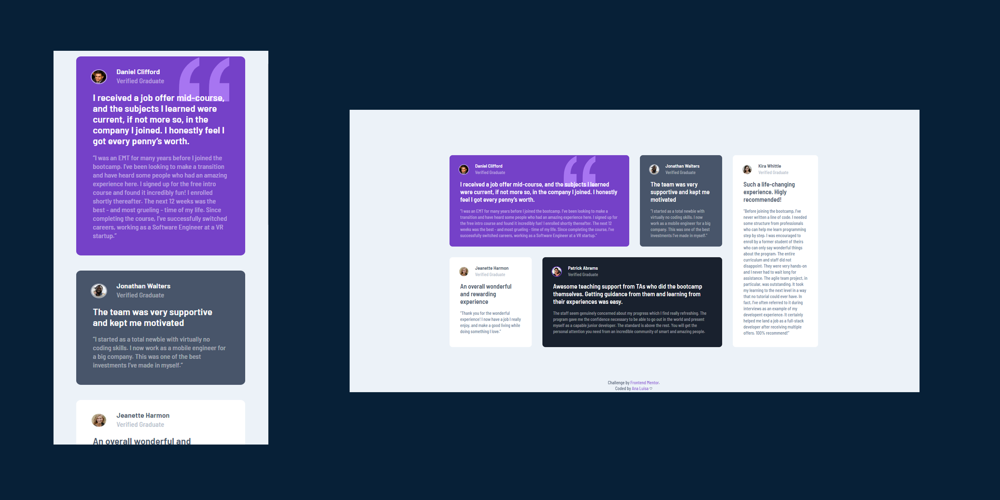

  

 
*<h1>Desafio Frontend Mentor</h1>Frontend Mentor Challenge*

*<h1>Pré-visualização</h1>Preview*

 

  <a href="https://www.frontendmentor.io/challenges/testimonials-grid-section-Nnw6J7Un7/hub" target="_blank"><strong>Página do desafio - Challenge page</strong></a>
   

  <a href="https://analuisafav.github.io/Testimonials-Grid/" target="_blank">Visualizar minha solução do desafio - View my challenge solution</a>

*<h1>Sobre</h1>About*

Mais um desafio no Frontend Mentor, com layout responsivo.

One more challenge on Frontend Mentor, with responsive layout.

*<h1>Feito com</h1>Built with*

  

*<h1>Vamos nos conectar?</h1>Let's connect?👋*

      

